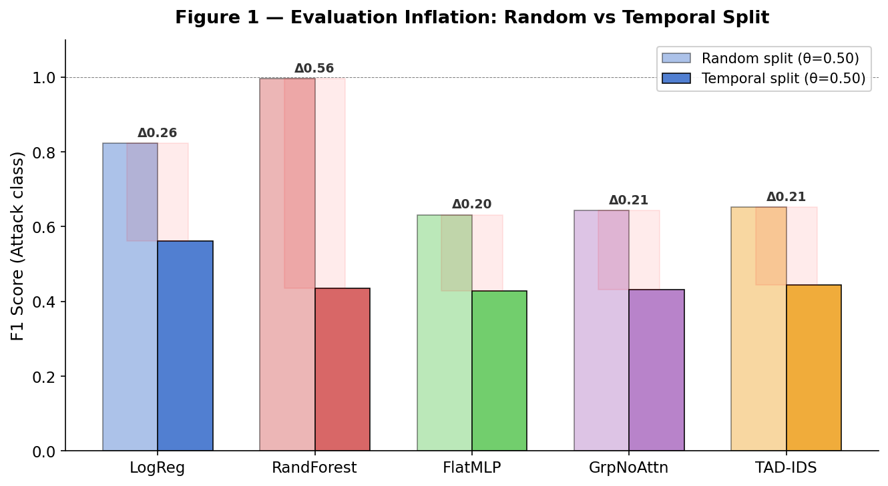
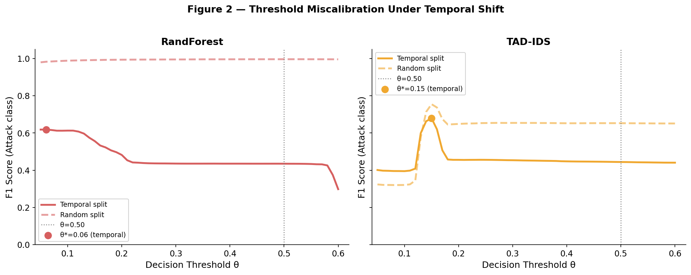
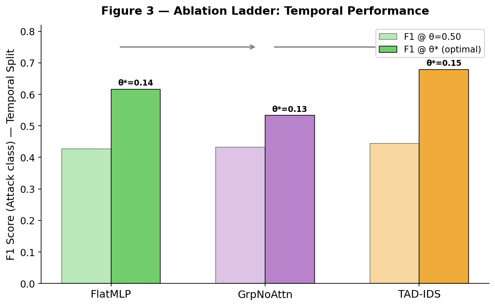
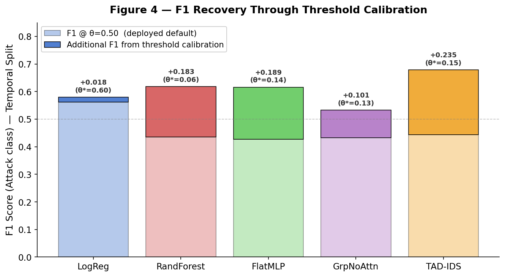

---

<h1 align="center">TAD-IDS</h1>

<p align="center">
  <em>Temporally Aware Deep Intrusion Detection System</em>
</p>

<p align="center">
<strong>Temporal Fragility in Network Intrusion Detection:<br>
Evaluation Methodology, Threshold Calibration, and Structured Feature Modeling</strong><br>
<em>A reproducible study on evaluation inflation in CIC-IDS-2017</em>
</p>

<p align="center">
  
  
  
  
  
  <a href="https://colab.research.google.com/github/heraclitus0/TAD-IDS/blob/main/Addressing_Temporal_Fragility_in_Network_Intrusion_Detection_via_Structured_Feature_Modeling.ipynb">
    
  </a>
</p>

---

## Abstract

Every published IDS result on CIC-IDS-2017 uses random 80/20 splits. In reality, a deployed model never trains on tomorrow's attacks. This repository quantifies exactly how much that methodological gap inflates reported performance.

We evaluate five model families — Logistic Regression, Random Forest, FlatMLP, GroupedNoAttn, and TAD-IDS — under both random-split and temporal-split protocols on the full CIC-IDS-2017 dataset (2.8M flows, 8 days). The core finding: **Random Forest achieves F1=0.9962 under random split and F1=0.4349 under temporal split — a gap of 0.5613.** Every model family degrades. No architecture is immune.

We further show that optimal decision thresholds under temporal shift are far from the standard θ=0.50, and that TAD-IDS — a structured architecture with semantic feature grouping and multi-head attention — achieves the highest recoverable temporal F1 (0.6789) when properly calibrated.

---

## The Core Finding

<p align="center">
  
  <br>
  <em>Figure 1: Evaluation inflation across model families. Random-split F1 vs temporal-split F1 at θ=0.50.<br>
  RF gap = 0.56. Every published RF result on CIC-IDS-2017 using random split overstates performance by this margin.</em>
</p>

---

## Results

### Table 1 — Evaluation Inflation (θ=0.50)

All models trained and tested under identical conditions.
`*` = temporal-trained model evaluated on random test set (lower bound — true gap is larger).

| Model | Random F1 | Temporal F1 | Gap |
| :--- | :---: | :---: | :---: |
| Logistic Regression | 0.8226 | 0.5617 | 0.2609 |
| **Random Forest** | **0.9962** | **0.4349** | **0.5613** |
| FlatMLP | 0.6318* | 0.4271 | 0.2047 |
| GroupedNoAttn | 0.6437* | 0.4323 | 0.2114 |
| TAD-IDS | 0.6525* | 0.4440 | 0.2085 |

### Table 2 — Threshold Calibration Under Temporal Shift

| Model | F1 @ θ=0.50 | F1 @ θ* | θ* | Lift |
| :--- | :---: | :---: | :---: | :---: |
| Logistic Regression | 0.5617 | 0.5793 | 0.60 | +0.018 |
| Random Forest | 0.4349 | 0.6183 | 0.06 | +0.183 |
| FlatMLP | 0.4271 | 0.6160 | 0.14 | +0.189 |
| GroupedNoAttn | 0.4323 | 0.5332 | 0.13 | +0.101 |
| **TAD-IDS** | **0.4440** | **0.6789** | **0.15** | **+0.235** |

No model should be deployed at θ=0.50 under temporal shift.
TAD-IDS recovers the most F1 (+0.235) from threshold calibration alone.

---

## Key Findings

**1. Evaluation inflation is real and large.**
Random Forest: F1=0.9962 (random split) → F1=0.4349 (temporal split). Gap = 0.5613.
Every published RF result on CIC-IDS-2017 using random split overstates performance by this margin.

**2. All model families degrade under temporal shift.**
Neural model gaps cluster around 0.20 at θ=0.50. No architecture is immune.
The evaluation protocol matters more than the model choice.

**3. Attention is the active ingredient, not grouping alone.**
TAD-IDS achieves F1=0.6789 at θ*=0.15 — highest of all models.
GroupedNoAttn underperforms FlatMLP at θ*, confirming that
semantic grouping without attention does not improve robustness.

**4. Threshold calibration is a deployment necessity.**
Optimal θ* under temporal shift ranges 0.06–0.15 across all models.
Models validated at θ=0.50 via random-split are systematically
miscalibrated for real deployment conditions.

---

## Figures

<p align="center">
  
  <br>
  <em>Figure 2: F1 vs decision threshold for RF and TAD-IDS under random and temporal splits.<br>
  Random-split curves peak near θ=0.50. Temporal-split curves peak at θ=0.06 and θ=0.15 respectively.</em>
</p>

<p align="center">
  
  <br>
  <em>Figure 3: Ablation ladder — FlatMLP → GroupedNoAttn → TAD-IDS under temporal split.<br>
  Grouping alone does not help. Attention drives the improvement.</em>
</p>

<p align="center">
  
  <br>
  <em>Figure 4: F1 recoverable through threshold calibration per model.<br>
  TAD-IDS recovers the most (+0.235). RF recovers +0.183 with no retraining.</em>
</p>

---

## Architecture

TAD-IDS treats the 78 CIC-IDS-2017 features not as a flat vector but as
six semantic groups reflecting measurement type:

```
packet     (20 features) — packet size statistics
timing     (15 features) — inter-arrival time statistics
flag       (12 features) — TCP flag counts
flow       (17 features) — flow-level rate features
connection (12 features) — connection state features
remaining  ( 2 features) — unassigned features
```

Each group is processed by a dedicated **GroupEncoder** (2-layer Linear +
residual + GELU + BatchNorm), producing a 32-dimensional embedding.
A single **AttentionBlock** (2 heads, pre-norm) computes cross-group
dependencies. A **LearnedTokenPool** produces a weighted summary vector
which is passed to an MLP classifier.

```
Input (78,)
  → 6 GroupEncoders        → (6, 32)
  → AttentionBlock (2 head) → (6, 32)
  → LearnedTokenPool        → (32,)
  → MLP: 32→64→32→1
  → BCEWithLogitsLoss
```

**Total trainable parameters: ~25K**

### Ablation Models

| Model | Description | Params |
| :--- | :--- | :---: |
| FlatMLP | No grouping, no attention. 78→256→128→64→1 | 62,337 |
| GroupedNoAttn | GroupEncoders + mean pool, no attention | 16,449 |
| TAD-IDS | Full architecture above | ~25K |

---

## Dataset & Protocol

**Dataset:** CIC-IDS-2017 (Canadian Institute for Cybersecurity)
8 CSV files, 78 features per flow, 2.8M total rows.

**Temporal split (our protocol — realistic):**
```
Train : Monday + Tuesday + Wednesday  (1,666,532 flows)
Test  : Thursday + Friday             (1,161,344 flows)
```

**Random split (literature protocol — inflated):**
```
Stratified 70/30 from all 8 files combined
```

**Critical preprocessing note:**
CIC-IDS-2017 contains NaN and inf values concentrated in attack rows.
Using `dropna` silently removes attack traffic and corrupts the test set.
The correct approach is `fillna(0)` after replacing inf with NaN.

---

## Reproducibility

The full experiment is a single 15-cell Colab notebook.

[](https://colab.research.google.com/github/heraclitus0/TAD-IDS/blob/main/Addressing_Temporal_Fragility_in_Network_Intrusion_Detection_via_Structured_Feature_Modeling.ipynb)

**To reproduce:**
1. Upload all 8 CIC-IDS-2017 CSV files to `My Drive/CIC-IDS-2017/`
2. Open the notebook in Colab
3. Run Cell 1 through Cell 15 in order
4. All results, figures, and checkpoints save automatically to Drive

**Session restart protocol:**
- Cells 2, 3, 4, 5 skip automatically if outputs exist on disk
- After restart: run Cell 1 → Cell 3 → Cell 5 → continue from checkpoint

**Requirements:**
```
Python  3.8+
PyTorch 2.0+
scikit-learn
numpy
pandas
pyarrow
```

---

## Quick Usage

```python
import torch
from models import TADIDS

# group sizes from CIC-IDS-2017 semantic decomposition
GROUP_SIZES       = [20, 15, 12, 17, 12, 2]   # sums to 78
GROUP_SLICES_LIST = [(0,20),(20,35),(35,47),
                     (47,64),(64,76),(76,78)]
N_GROUPS          = 6

model = TADIDS(
    group_sizes=GROUP_SIZES,
    embed_dim=32,
    num_heads=2,
    n_groups=N_GROUPS
).to(device)

# x : (batch, 78) — StandardScaler normalized
logits = model(x, GROUP_SLICES_LIST)   # (batch,) raw logits
probs  = torch.sigmoid(logits)

# NOTE: do not threshold at 0.50 under temporal shift
# optimal threshold is ~0.15 — see Table 2
```

---

## Training Configuration

```python
loss       = BCEWithLogitsLoss(pos_weight=tensor([2.47]))
optimizer  = Adam(lr=3e-4, weight_decay=1e-4)
scheduler  = ReduceLROnPlateau(mode='max', patience=2, factor=0.5)
early_stop = patience=3 on validation F1   # NOT loss
batch_size = 2048
max_epochs = 20
grad_clip  = 1.0
label_smooth = 0.05
```

Early stopping on F1 (not loss) is critical — validation loss increases
under temporal shift even when the model is generalizing correctly.

---

## Citation

If you use this work, please cite:

```bibtex
@misc{tadids2025,
  title  = {Temporal Fragility in Network Intrusion Detection:
             Evaluation Methodology, Threshold Calibration,
             and Structured Feature Modeling},
  author = {Bharadwaj},
  year   = {2025},
  note   = {Research prototype. CIC-IDS-2017 temporal split study.},
  url    = {https://github.com/heraclitus0/TAD-IDS}
}
```

---

## License

This project is released under the **[MIT License](LICENSE)**.

```
